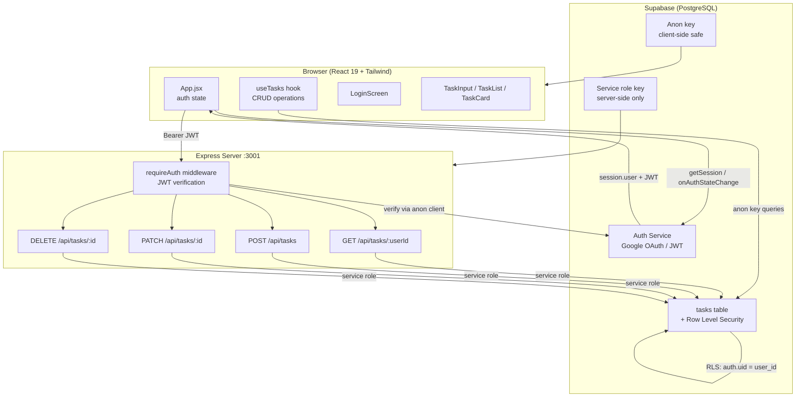

# Personal OS

A personal productivity dashboard built with React 19, Express, and Supabase. Themed as an "Imperial Command Center" with a dark gold UI.

---

## Table of Contents

1. [Quick Start](#quick-start)
2. [Architecture](#architecture)
3. [System Design Diagram](#system-design-diagram)
4. [API Reference](#api-reference)
5. [Security](#security)
6. [Testing](#testing)
7. [Technical Debt](#technical-debt)
8. [TypeScript Migration Plan](#typescript-migration-plan)
9. [Feature Specifications](#feature-specifications)
10. [PR Review Findings](#pr-review-findings)

---

## Quick Start

### Prerequisites
- Node.js 18+
- A Supabase project with a `tasks` table (see schema below)
- Google OAuth configured in Supabase Auth

### Environment Variables

Create `.env.local` in the project root:
```env
VITE_SUPABASE_URL=https://your-project.supabase.co
VITE_SUPABASE_ANON_KEY=your-anon-key
SUPABASE_SERVICE_ROLE_KEY=your-service-role-key
VITE_SUPABASE_ANON_KEY=your-anon-key
# Optional: restrict allowed CORS origins (comma-separated)
ALLOWED_ORIGINS=http://localhost:5173,https://yourdomain.com
```

> **Warning**: Never commit `.env.local`. It is listed in `.gitignore`.

### Database Schema

```sql
create table tasks (
  id uuid primary key default gen_random_uuid(),
  user_id uuid references auth.users not null,
  title text not null,
  status text not null default 'todo' check (status in ('todo', 'in-progress', 'done')),
  priority text not null default 'medium' check (priority in ('low', 'medium', 'high')),
  created_at timestamptz default now()
);

-- Enable Row Level Security
alter table tasks enable row level security;

create policy "Users can only access their own tasks"
  on tasks for all
  using (auth.uid() = user_id);
```

### Installation

```bash
npm install

# Terminal 1 — frontend
npm run dev

# Terminal 2 — backend
npm run server
```

---

## Architecture

```
personal-os/
├── src/
│   ├── lib/
│   │   └── supabase.js          # Shared Supabase anon client
│   ├── hooks/
│   │   └── useTasks.js          # Task CRUD state hook
│   ├── components/
│   │   ├── LoginScreen.jsx      # Google OAuth gate
│   │   ├── TaskInput.jsx        # Controlled input + submit
│   │   ├── TaskCard.jsx         # Task row with status cycle + delete
│   │   └── TaskList.jsx         # Loading / error / empty states
│   ├── App.jsx                  # Auth state + layout shell
│   └── main.jsx                 # React entry point
├── server.js                    # Express API with JWT auth middleware
├── vite.config.js               # Vite + Vitest config
└── index.html
```

**Data flow:**
- **Auth**: Supabase Auth handles Google OAuth. The anon client issues JWTs; the React app stores the session in memory.
- **Frontend queries**: `useTasks` hits Supabase directly with the anon key. Row Level Security enforces per-user isolation.
- **Backend API**: Express acts as a server-side proxy when server-only operations are needed (e.g., bulk writes, admin actions). All routes require a valid Supabase JWT in the `Authorization` header.

---

## System Design Diagram



---

## API Reference

All routes except `/api/health` require:
```
Authorization: Bearer <supabase-jwt>
```

### GET /api/health
Returns server status. No auth required.

```json
{ "status": "Imperial Engine Online", "timestamp": "2025-05-31T00:00:00.000Z" }
```

### GET /api/tasks/:userId
Returns all tasks for the authenticated user. Returns `403` if `userId` doesn't match the JWT subject.

**Response:** `Task[]`

### POST /api/tasks
Creates a new task owned by the authenticated user.

**Body:**
```json
{ "title": "string (required)", "priority": "low | medium | high (default: medium)" }
```
**Response:** `Task` (201)

### PATCH /api/tasks/:taskId
Updates `status` and/or `priority` on an owned task.

**Body:**
```json
{ "status": "todo | in-progress | done", "priority": "low | medium | high" }
```
**Response:** `Task`

### DELETE /api/tasks/:taskId
Deletes an owned task. Returns `204 No Content`.

---

## Security

### Fixed in this version
| Issue | Fix |
|-------|-----|
| No authentication on API routes | `requireAuth` middleware verifies Supabase JWT on every non-health route |
| CORS open to all origins | Restricted to `ALLOWED_ORIGINS` env var |
| Raw Supabase errors leaked to client | Generic error messages; details logged server-side only |
| `user_id` injected from request body | Server now uses `req.user.id` from verified JWT |
| No input validation | Title and priority validated before DB write |
| No DELETE or PATCH endpoints | Added with ownership checks |

### Still to address
- Add rate limiting (`express-rate-limit`) to prevent abuse
- Add HTTPS enforcement (use a reverse proxy like Nginx or deploy to a platform with TLS)
- Audit Supabase RLS policies to ensure they cover all access patterns
- Rotate `SUPABASE_SERVICE_ROLE_KEY` if it was ever committed to git history

---

## Testing

Tests use **Vitest** + **@testing-library/react**.

```bash
npm install        # install new test dependencies first
npm test           # run all tests once
npm run test:watch # watch mode
```

Test coverage:
- `TaskCard` — title render, status cycle (todo→in-progress→done→todo), delete, priority border colors
- `TaskInput` — submit on click, submit on Enter, clears after submit, blocks empty/whitespace input
- `TaskList` — loading state, error state, empty state, renders all tasks

---

## Technical Debt

### High priority
| Item | Impact | Effort |
|------|--------|--------|
| No TypeScript | Type errors at runtime, poor IDE support | High |
| No CI pipeline | Regressions ship undetected | Low |
| No error boundary | Unhandled React errors crash entire app | Low |
| Auth session not persisted on refresh | User must re-login on page reload | Medium |

### Medium priority
| Item | Impact | Effort |
|------|--------|--------|
| `recharts` imported but unused | Bundle bloat (+280 kB) | Low — remove when dashboard is planned |
| `axios` imported but unused | Bundle bloat | Low — remove or replace Supabase client calls |
| No loading skeleton | Flash of empty content on mount | Low |
| `onKeyPress` was deprecated | Silent breakage in future React | Fixed in this PR |

### Low priority
| Item | Impact | Effort |
|------|--------|--------|
| No structured logging | Hard to debug production issues | Medium |
| No request ID tracing | Can't correlate frontend errors to backend logs | Medium |
| Single-file server | Hard to unit test routes in isolation | Medium |

---

## TypeScript Migration Plan

This is a 3-phase plan. Each phase ships independently.

### Phase 1 — Config & types (1 day)
1. `npm install -D typescript @types/react @types/react-dom @types/node @types/express @types/cors`
2. Generate `tsconfig.json` with `"strict": true`, `"jsx": "react-jsx"`, `"target": "ES2022"`
3. Add `@types/supabase` or generate types with `supabase gen types typescript`
4. Rename `vite.config.js` → `vite.config.ts`

### Phase 2 — Backend (0.5 days)
1. Rename `server.js` → `server.ts`
2. Type `req.user` via Express `Request` extension
3. Add `Task` interface matching DB schema
4. Add `tsx` for running TypeScript server: `npm install -D tsx`
5. Update `package.json` `"server"` script to `tsx server.ts`

### Phase 3 — Frontend (1 day)
1. Rename files: `.jsx` → `.tsx`, `.js` → `.ts`
2. Type `useTasks` hook return value
3. Type all component props
4. Fix any strict-mode errors

**Risk:** React 19 + Vite 4 may need `@vitejs/plugin-react` v4 or higher — verify compatibility before starting.

---

## Feature Specifications

### Feature 1: Task Status Management (shipped)
**Status:** Done  
Users can cycle tasks through `todo → in-progress → done → todo` by clicking the status badge. Delete button appears on hover.

---

### Feature 2: Priority Assignment UI
**Status:** Planned

**Problem:** Priority is stored in the DB but cannot be set from the UI.

**Acceptance criteria:**
- On task creation, user can select priority from a dropdown (low / medium / high), defaulting to medium
- Priority can be changed inline on an existing task card
- Cards visually indicate priority (border color: red/yellow/gray — already implemented)

**API:** `PATCH /api/tasks/:taskId` with `{ priority }` — already implemented.

**UI changes:**
- `TaskInput`: add `<select>` next to the text input
- `TaskCard`: clicking the priority label opens an inline select

---

### Feature 3: AI Directive Assistant
**Status:** Planned (Anthropic SDK already installed)

**Problem:** Users face blank-slate anxiety when adding tasks.

**Acceptance criteria:**
- A "Suggest directives" button calls a new `POST /api/ai/suggest` endpoint
- The endpoint uses Claude (Anthropic SDK) to suggest 3–5 tasks based on user's existing task list
- Suggestions appear as ghost cards; clicking one adds the task

**Backend sketch:**
```javascript
// POST /api/ai/suggest
import Anthropic from '@anthropic-ai/sdk';
const client = new Anthropic();
const tasks = await fetchUserTasks(req.user.id);
const message = await client.messages.create({
  model: 'claude-opus-4-8',
  max_tokens: 256,
  messages: [{
    role: 'user',
    content: `Given these tasks: ${tasks.map(t => t.title).join(', ')}, suggest 3 new tasks.`
  }]
});
```

---

### Feature 4: Analytics Dashboard
**Status:** Planned (Recharts already installed)

**Metrics to show:**
- Tasks completed per day (line chart)
- Task distribution by priority (pie chart)
- Average time to completion (requires `completed_at` column)

**Schema addition:**
```sql
alter table tasks add column completed_at timestamptz;
```

---

## PR Review Findings

> Workflow #1 from the 12 Advanced Workflows infographic — reviewed as a senior engineer.

### Bugs fixed
- **`onKeyPress` deprecated** (`App.jsx:63`): Replaced with `onKeyDown`. `onKeyPress` is removed in React 19.
- **Auth state not subscribed**: Original `useEffect` only called `getSession()` once, missing subsequent sign-in/sign-out events. Fixed with `onAuthStateChange` subscription + cleanup.
- **`user_id` from request body** (`server.js:36`): A malicious client could supply any `user_id` and write tasks for other users. Fixed: `user_id` now comes exclusively from the verified JWT (`req.user.id`).

### Security issues fixed
- Unauthenticated API endpoints — see Security section above.
- Global CORS — restricted to `ALLOWED_ORIGINS`.
- Raw DB errors in responses — replaced with generic messages.

### Code quality improvements
- `App.jsx` split into 5 focused modules (LoginScreen, TaskInput, TaskCard, TaskList, useTasks hook).
- Supabase client moved to `src/lib/supabase.js` — single source of truth, no duplicate `createClient` calls.
- Loading and error states added to task list.
- Delete and status-cycle interactions added to `TaskCard`.
- Server exports `app` for future testability.

### Remaining recommendations
- Add an error boundary around `<App />` in `main.jsx`.
- Add `<React.Suspense>` for lazy-loaded routes when React Router is wired up.
- Consider `zod` for runtime validation on the Express routes.
